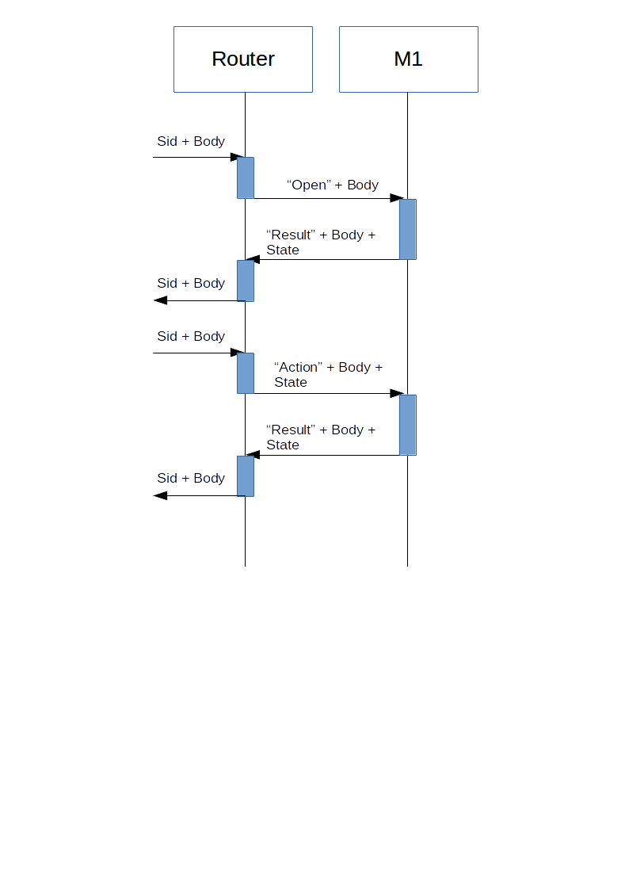
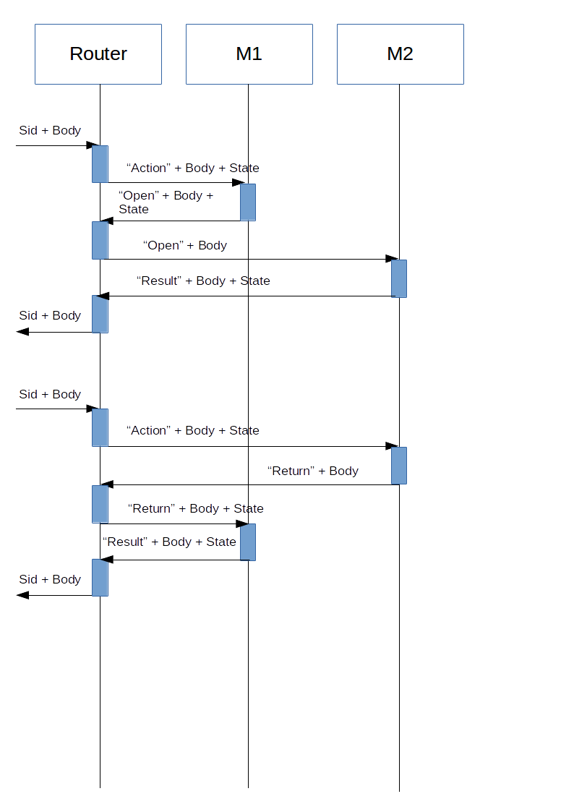

# CloudBunch

## Идея - Cloud Ready иерархическая *State machine*.

Многие интерактивные приложения это 
определенная, часто - разветвленная последовательность 
вопросов и ответов, 
причем вопросы задает приложение, а отвечает на них 
клиент. Для описания подобных последовательностей
удобно и целесообразно использовать *State machine* (SM), 
для больших и разветвленных - декомпозированную иерархическую 
*State machine* (HSM). Иногда их также называют *Flow machine*.

Раз уже речь зашла о больших и разветвленных приложениях и их 
декомпозиции, имеет смысл говорить и о декомпозиции процесса 
разработки. Было бы неплохо раздать командам разработчиков 
отдельные фичи нашего приложения и позволить им выпускать релизы по
готовности, без ПИРов и фризов. Тоесть разбив большое и сложное
приложение на маленькие и простые <b>микросервисы</b>...

Как известно, микросервисы очень хороши когда они не хранят в себе 
состояния (сессии), слабо связаны и общаются между собой в соответствии с 
формальным контрактом. Тогда система становится горизонтально 
масштабируемой, детерминированной, управляемой и надежной, ко всем 
приходит неизбежное счастье.

### Как это может быть организовано?

### CloudBunch - мир будущего

Router хранит стек открытых в контексте сессии 
клиента сервисов вместе с их текущими состояниями. 
На верху стека находится активный в данный момент 
сервис.

Все запросы от клиента поступают на Router. Router перенаправляет их на активный сервис.

Открытие (вызов) нового слоя осуществляется ответом от сервиса роутеру (тип OPEN). 
Когда активный сервис закрывается, его результат перенаправляется опять-же через роутер на вызывающий сервис. 

#### Схема прохождения обычного запроса

В первом варианте - сессия и состояние отсутствуют, открывапется первый слой , сервис по умолчанию.

Во втором варианте состояние присутствует, запрос направляется в активный сервис

### Схема взаимодействия между сервисами (открытие нового слоя, возврат на предыдущий слой)

